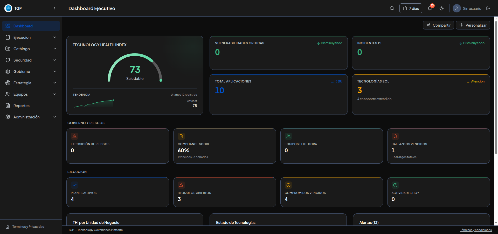
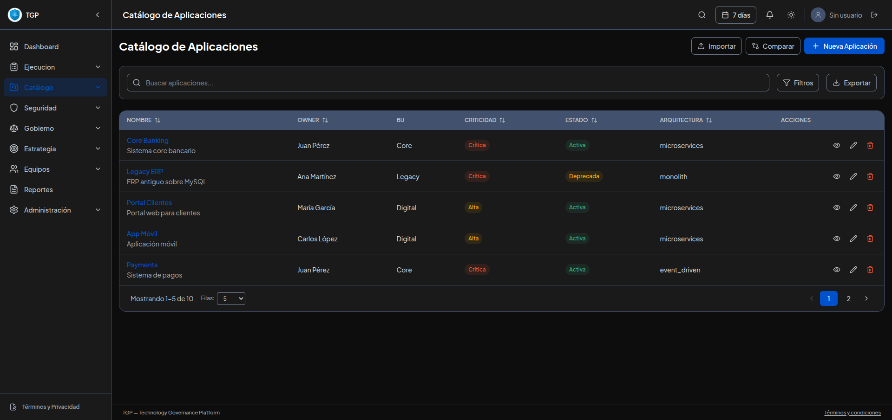
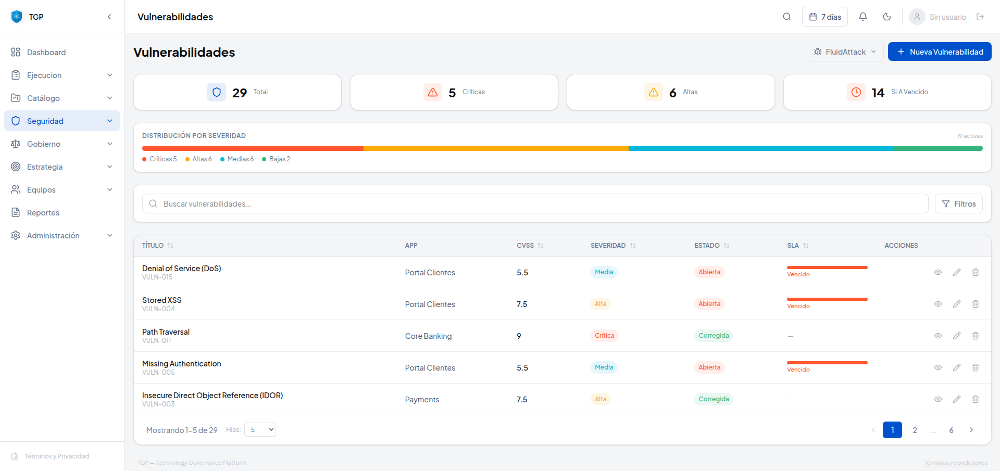
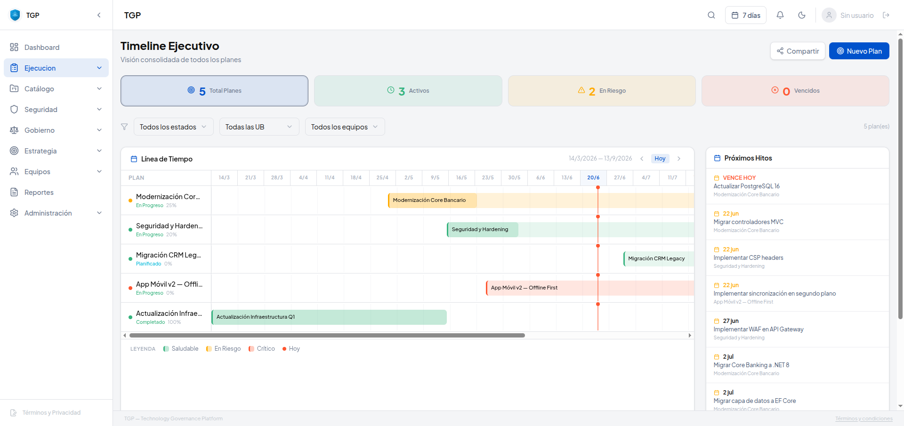

<picture>
  <source media="(prefers-color-scheme: dark)" srcset="https://img.shields.io/badge/TGP-Plataforma%20de%20Gobierno%20Tecnol%C3%B3gico-6366f1?style=for-the-badge&labelColor=1e1b4b" />
  <source media="(prefers-color-scheme: light)" srcset="https://img.shields.io/badge/TGP-Plataforma%20de%20Gobierno%20Tecnol%C3%B3gico-6366f1?style=for-the-badge&labelColor=eef2ff" />
  
</picture>

<p align="center">
  <strong>SPA cliente-side para gobierno tecnológico empresarial — aplicaciones, seguridad, riesgos, OKRs, equipos y seguimiento de ejecución.</strong>
</p>

<p align="center">
  <a href="#caracteristicas">Características</a> •
  <a href="#stack">Stack</a> •
  <a href="#primeros-pasos">Primeros Pasos</a> •
  <a href="#arquitectura">Arquitectura</a>
</p>

<p align="center">
  
  
  
  
  
  
</p>

---

## Características

### 📊 Dashboard Ejecutivo
**Technology Health Index (THI)** en tiempo real — puntuación compuesta en 7 dimensiones ponderadas (Delivery, Seguridad, Obsolescencia, Riesgo, y más). Tarjetas KPI interactivas con drill-down, gráficos de distribución por severidad y filtro por período.

### 📋 Catálogo de Aplicaciones
CRUD completo con búsqueda avanzada, filtros por criticidad/estado/BU, y vista de detalle que consolida vulnerabilidades, riesgos, incidentes y hallazgos **heredados** de microservicios vinculados. Importación desde Excel con upsert inteligente.

### 🔒 Seguridad y Gobierno
Vulnerabilidades con puntuación CVSS, SLA y flujo de estados. Incidentes con severidad P1-P4 y tracking de tiempos de respuesta. Matriz de **riesgos** (probabilidad × impacto) y **hallazgos de auditoría** con evidencia adjunta y planes de acción.

### 🎯 OKRs y Estrategia
Objetivos con Key Results, tracking de período, cálculo de progreso y monitoreo de estado (on track, at risk, behind, achieved). Vincula entregables y planes a objetivos estratégicos.

### 🚀 Seguimiento de Ejecución
Planes con **diagramas de Gantt**, línea de tiempo diaria, compromisos, bloqueos y mapa de dependencias. Servicio de escalamiento para items vencidos. Vista semanal con hitos próximos.

### 👥 Equipos y Métricas DORA
Gestión de equipos con **métricas DORA** (frecuencia de deploy, lead time, change failure rate, MTTR). Benchmarking automático Elite / Alto / Medio / Bajo.

### 🔗 Enlaces Públicos
Generación de **enlaces públicos cifrados y con expiración** para cualquier vista — dashboard, daily, planes, vulnerabilidades, riesgos, auditoría, OKRs y más. Cifrado AES-GCM 256 en reposo con passphrase opcional. Almacenamiento en Azure Blob Storage o localStorage.

### ⚡ 100% Cliente-Side
Sin dependencias de servidor. Todos los datos en **IndexedDB** (Dexie.js). Backup en la nube y enlaces públicos vía Azure Blob Storage. Autenticación TOTP con código QR.

---

## Capturas

<p align="center">
  
  <br />
  <em>Dashboard Ejecutivo — THI, KPI cards y distribución por severidad</em>
</p>

<p align="center">
  
  <br />
  <em>Catálogo de Aplicaciones — CRUD, filtros y vista de portafolio</em>
</p>

<p align="center">
  
  <br />
  <em>Seguridad — Vulnerabilidades con CVSS, SLA y flujo de estados</em>
</p>

<p align="center">
  
  <br />
  <em>Ejecución — Timeline con diagrama de Gantt y planificación</em>
</p>

---

## Stack

| Capa | Tecnología |
|---|---|
| **Core** | React 19, TypeScript 5, Vite 6 + SWC |
| **Ruteo** | React Router v7 |
| **Estado** | Zustand 5 |
| **Base de datos** | Dexie.js 4 (IndexedDB) |
| **Estilos** | Tailwind CSS 4 + design system propio |
| **Formularios** | React Hook Form + Zod |
| **Gráficos** | Recharts + ApexCharts |
| **Iconos** | Lucide React |
| **Auth** | TOTP (otpauth + QR code) |
| **Nube** | Azure Blob Storage |
| **Importación** | SheetJS (XLSX) |

---

## Primeros Pasos

```bash
# Clonar
git clone https://github.com/DiogenesPolanco/TGP.git
cd TGP

# Instalar
npm install

# Iniciar servidor de desarrollo
npm run dev

# Compilar para producción
npm run build
```

La aplicación corre completamente en el navegador — no requiere backend. Puedes cargar un dataset demo desde la interfaz para explorar las funcionalidades.

> **Primer inicio**: Escanea el código QR con cualquier app de autenticación (Google Authenticator, Authy, 1Password) para configurar TOTP.

---

## Arquitectura

La aplicación sigue una estructura **feature-first** sobre una librería de componentes UI compartidos.

```
src/
├── components/     # UI compartida (botones, modales, badges, layout)
├── features/       # Módulos por dominio (catalog, security, governance, execution, etc.)
├── services/       # Capa de datos (repos Dexie, import/export, sync, motor THI)
├── stores/         # Stores Zustand
├── hooks/          # Hooks React compartidos
├── types/          # Tipos TypeScript de dominio
└── lib/            # Utilidades
```

Decisiones arquitectónicas clave:

- **Fuente única de verdad**: Todos los datos de dominio en IndexedDB con Dexie.js (20+ tablas)
- **Herencia de entidades**: Vulnerabilidades, riesgos, incidentes y hallazgos pueden vincularse a microservicios y ser heredados automáticamente por sus aplicaciones padre
- **Offline-first**: Todo funciona sin red — las funcionalidades en la nube (backup, sharing) son adicionales
- **Enlaces cifrados**: Los enlaces públicos siempre se cifran en reposo con AES-GCM 256

---

## Estado del Proyecto

Desarrollo activo. Construido para necesidades de gobierno empresarial, diseñado para ser autónomo y fácil de desplegar — solo sirve la carpeta de build estático.

---

## Licencia

Propietaria — TGP &copy; 2026
